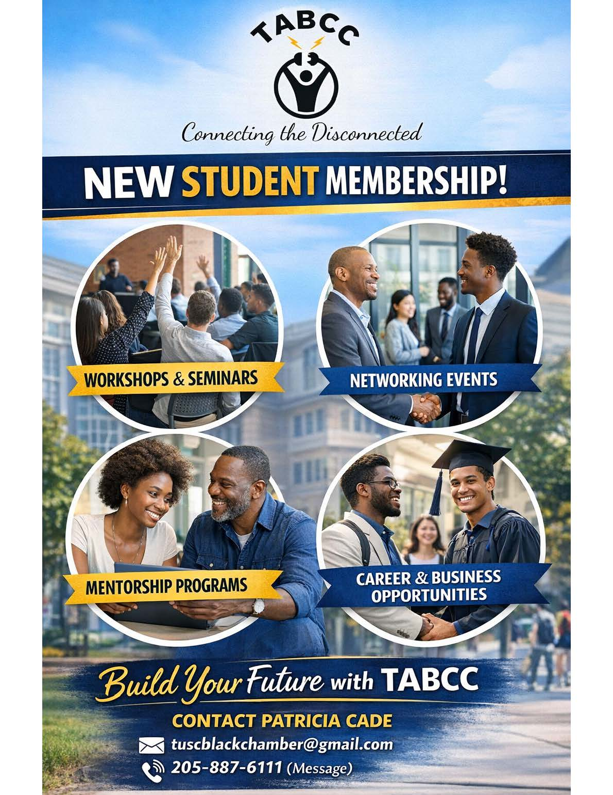

## Membership Benefits

* Advocacy
* Referrals
* Business management counseling and assistance
* Business marketing support
* Free seminars and workshops
* Monthly networking opportunities
* Entry in the TABCC Member Directory
* Free website review by [RHT Services LLC](https://rhtservices.net)
* Annual business opportunity conference/expo

## Become A Member

To join the Tuscaloosa Area Black Chamber of Commerce, please complete the
[printable membership application](/membership/2026application.pdf) or the 
[online membership application](https://docs.google.com/forms/d/e/1FAlpQLSfm6Mmw2tzbtPnnOHMw1WwWX4ollu17WmFKowSpaYUBt31qug/viewform).

## Pay Membership Dues Online

To pay dues online, use the QR below to select the membership type that you are paying for and 
then click the Buy Now button or scan the QR code below to pay with Paypal.

## Student Membership

