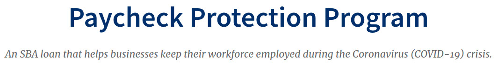

The resources listed here are for those interested in starting a businesss or if you have your
business already running and need additional capital. As always, you can [contact TABCC](/contact)
for additional resources and information.

## Small-Business Grants

There are a number of small business grants that are available to small businesses. A grant is money that 
does not have to be paid back. Find out more about these grants and to see if you qualify.
[Find out more about grants](https://www.nerdwallet.com/article/small-business/small-business-grants) on Nerd Wallet website.

## Paycheck Protection Program (PPP)

Certain eligible borrowers that previously received a PPP loan are eligible for a second loan with the 
same loan terms through the additional funding Congress passed. Borrowers can apply for a Second Draw PPP 
Loan until March 31, 2021.
[Read more about PPP](https://www.sba.gov/funding-programs/loans/coronavirus-relief-options/paycheck-protection-program) on the SBA website.

## Other Resources

<a href="https://loans.usnews.com/small-business" target="_blank">Best Small Business Loans</a>

<a href="https://loans.usnews.com/unsecured-business-loans" target="_blank">Best Unsecured Business Loans</a>

<a href="https://loans.usnews.com/business-loans-for-bad-credit" target="_blank">Best Business Loans for Bad Credit</a>

<a href="https://creditcards.usnews.com/business#benefits-business-credit-cards" target="_blank">Benefits of Business Credit Cards</a>

[Starting A Business by Atlas Alabama](https://atlasalabama.gov/plan/)

## IRS Resources

Below are resources provided by the IRS (Internal Revenue Service) for businesses. Some of these resources 
include those that are specific to the COVID-19 Pandemic. 

Claiming the Earned Income Tax Credit? Get the EITC and all the IRS tax credits you deserve without spending a cent. 
Find a free tax prep site near you: <a href="https://www.irs.gov/vita" target="_blank">www.irs.gov/vita</a> 
Unemployment compensation must be reported on your #IRS tax return. Learn more at 
<a href="https://www.irs.gov/uc" target="_blank">www.irs.gov/uc</a>

If you still file a paper tax return, there is no better time to switch to e-file. Avoid unnecessary paper processing delays in 2021: 
<a href="https://www.irs.gov/efile" target="_blank">www.irs.gov/efile</a>

Many pages on IRS.gov are available in 7 different languages. Some products are translated into more than 30.
Get A Closer Look at the IRS strategy for helping taxpayers in other languages. 
<a href="https://go.usa.gov/xAfwq" target="_blank">https://go.usa.gov/xAfwq</a>

IRS has free resources for small organizations and self-employed individuals with retirement plans. 
Learn how to choose, maintain and correct your plan at: <a href="https://go.usa.gov/xAv3d" target="_blank">https://go.usa.gov/xAv3d</a>.

Getting ready to file your 2020 tax return? Read these important IRS reminders:
<a href="https://go.usa.gov/xAtk5" target="_blank">https://go.usa.gov/xAtk5</a>

If someone has used your identity to claim unemployment compensation, IRS has guidance that may help: 
<a href="https://go.usa.gov/xAFwr" target="_blank">https://go.usa.gov/xAFwr</a>

